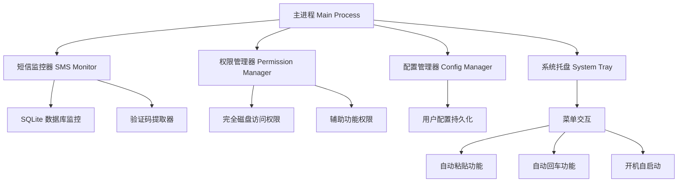

# MessAuto-Electron 项目初始化设计文档

## 项目概述

MessAuto-Electron 是一个基于 Electron 的 macOS 桌面应用程序，用于自动提取短信验证码并实现自动粘贴和回车功能。该应用程序将在系统托盘中运行，提供无界面的后台服务。

### 技术栈
- **主框架**: Electron
- **前端框架**: Vue 3 + TypeScript
- **构建工具**: Vite
- **包管理器**: npm/yarn
- **目标平台**: macOS

## 架构设计

### 整体架构



### 进程架构

``mermaid
graph LR
    A[主进程<br/>Main Process] --> B[文件系统监控]
    A --> C[系统权限检查]
    A --> D[托盘菜单管理]
    A --> E[自动化操作执行]
    
    F[渲染进程<br/>Renderer Process] --> G[权限引导界面]
    F --> H[设置配置界面]
    
    A <--> F
```

## 核心模块设计

### 1. 短信监控模块 (SMS Monitor)

#### 功能职责
- 监控 macOS Messages 数据库文件变化
- 提取新接收的短信内容
- 使用正则表达式识别验证码

#### 技术实现
``typescript
interface SMSMonitor {
  startMonitoring(): void;
  stopMonitoring(): void;
  onNewMessage(callback: (message: string) => void): void;
}

interface VerificationCode {
  code: string;
  confidence: number;
  timestamp: Date;
}
```

#### 数据库访问策略
- 监控文件: `~/Library/Messages/chat.db-wal`
- 查询策略: 获取最近1分钟内的最新消息
- 关键词识别: `["验证码", "verification", "code", "인증"]`
- 正则模式: `/\b\d{4,7}\b|\b[A-Z0-9]{4,7}\b/g`

### 2. 权限管理模块 (Permission Manager)

#### 权限类型
| 权限类型 | 用途 | 检查方法 |
|---------|------|----------|
| 完全磁盘访问 | 访问 Messages 数据库 | 尝试读取 chat.db 文件 |
| 辅助功能 | 键盘自动化操作 | 检查 Accessibility API |

#### 权限检查流程

``mermaid
flowchart TD
    A[应用启动] --> B[检查完全磁盘访问权限]
    B --> C{权限已授予?}
    C -->|否| D[显示权限引导对话框]
    C -->|是| E[检查辅助功能权限]
    
    D --> F[用户手动授权]
    F --> E
    
    E --> G{权限已授予?}
    G -->|否| H[显示辅助功能引导]
    G -->|是| I[启动监控服务]
    
    H --> J[用户手动授权]
    J --> I
```

### 3. 系统托盘模块 (System Tray)

#### 托盘菜单结构
```
📨 MessAuto
├── ✅ 自动粘贴 (auto_paste)
├── ✅ 自动回车 (auto_return) [依赖自动粘贴]
├── 📁 隐藏图标
│   ├── 暂时隐藏
│   └── 永久隐藏
├── ✅ 登录时启动 (launch_at_login)
├── ── 分隔线 ──
└── ❌ 退出
```

#### 菜单状态管理
```typescript
interface TrayMenuState {
  autoPaste: boolean;
  autoReturn: boolean;
  launchAtLogin: boolean;
  hideIconForever: boolean;
}
```

### 4. 自动化操作模块 (Automation)

#### 操作类型
- **剪贴板操作**: 将验证码写入系统剪贴板
- **键盘模拟**: 模拟 Cmd+V (粘贴) 和 Enter (回车)
- **时序控制**: 确保操作之间的适当延迟

#### 实现策略
``typescript
interface AutomationService {
  copyToClipboard(text: string): Promise<void>;
  simulatePaste(): Promise<void>;
  simulateEnter(): Promise<void>;
  executeAutoSequence(code: string): Promise<void>;
}
```

### 5. 配置管理模块 (Config Manager)

#### 配置文件结构
```json
{
  "version": "1.0.0",
  "settings": {
    "auto_paste": false,
    "auto_return": false,
    "hide_icon_forever": false,
    "launch_at_login": false,
    "language": "auto"
  },
  "monitoring": {
    "check_interval": 1000,
    "message_lookback_minutes": 1
  }
}
```

#### 配置存储位置
- 配置文件: `~/.config/messauto/messauto.json`
- 使用 `electron-store` 进行持久化存储

## 项目结构

```
MessAuto-Electron/
├── .qoder/
│   └── quests/
├── src/
│   ├── main/                    # 主进程代码
│   │   ├── index.ts            # 应用程序入口
│   │   ├── tray.ts             # 系统托盘管理
│   │   ├── monitor.ts          # 短信监控服务
│   │   ├── permissions.ts      # 权限管理
│   │   ├── automation.ts       # 自动化操作
│   │   ├── config.ts           # 配置管理
│   │   └── database.ts         # 数据库访问
│   ├── renderer/               # 渲染进程代码
│   │   ├── components/         # Vue 组件
│   │   ├── views/              # 页面视图
│   │   ├── stores/             # 状态管理
│   │   └── main.ts            # 渲染进程入口
│   ├── shared/                 # 共享代码
│   │   ├── types.ts           # TypeScript 类型定义
│   │   ├── constants.ts       # 常量定义
│   │   └── utils.ts           # 工具函数
│   └── preload/               # 预加载脚本
│       └── index.ts
├── locales/                   # 国际化语言文件
│   ├── en.json
│   └── zh-CN.json
├── assets/                    # 静态资源
│   ├── icons/
│   │   ├── icon.png
│   │   ├── icon@2x.png
│   │   └── tray-icon.png
│   └── images/
├── build/                     # 构建配置
│   ├── icons/
│   └── entitlements.plist     # macOS 权限配置
├── dist/                      # 构建输出
├── package.json
├── electron.vite.config.ts    # Vite 配置
├── tsconfig.json
└── README.md
```

## 依赖包管理

### 核心依赖

| 包名 | 版本 | 用途 |
|------|------|------|
| electron | ^latest | Electron 主框架 |
| vue | ^3.x | 前端框架 |
| typescript | ^5.x | TypeScript 支持 |
| electron-vite | ^latest | 构建工具 |

### 功能依赖

| 包名 | 用途 | 备选方案 |
|------|------|----------|
| sqlite3 | 数据库访问 | better-sqlite3 |
| robotjs | 键盘自动化 | @nut-tree/nut-js |
| electron-store | 配置存储 | conf |
| auto-launch | 开机自启 | node-auto-launch |
| chokidar | 文件监控 | fs.watch |

### 开发依赖

| 包名 | 用途 |
|------|------|
| @types/node | Node.js 类型定义 |
| electron-builder | 应用打包 |
| vite | 构建工具 |
| eslint | 代码检查 |
| prettier | 代码格式化 |

## 数据流设计

### 验证码处理流程

``mermaid
sequenceDiagram
    participant FS as 文件监控
    participant DB as SQLite查询
    participant RE as 正则提取
    participant CB as 剪贴板
    participant AU as 自动化操作
    
    FS->>DB: 检测到新消息
    DB->>RE: 查询最新短信内容
    RE->>CB: 提取验证码
    CB->>AU: 写入剪贴板
    
    alt 自动粘贴启用
        AU->>AU: 模拟 Cmd+V
        alt 自动回车启用
            AU->>AU: 模拟 Enter
        end
    end
```

### 配置同步流程

``mermaid
sequenceDiagram
    participant UI as 托盘菜单
    participant CM as 配置管理器
    participant FS as 文件系统
    participant SV as 服务模块
    
    UI->>CM: 用户修改设置
    CM->>FS: 持久化配置
    CM->>SV: 通知配置变更
    SV->>SV: 应用新配置
```

## 安全与权限

### macOS 权限要求

#### 完全磁盘访问权限
- **目的**: 访问 `~/Library/Messages/chat.db`
- **申请方式**: 引导用户手动在系统偏好设置中添加
- **检验方法**: 尝试读取数据库文件

#### 辅助功能权限
- **目的**: 执行键盘自动化操作
- **申请方式**: 调用系统 API 弹出权限请求
- **检验方法**: 使用 Accessibility API 测试

### 应用签名和公证

``xml
<!-- entitlements.plist -->
<?xml version="1.0" encoding="UTF-8"?>
<!DOCTYPE plist PUBLIC "-//Apple//DTD PLIST 1.0//EN" 
"http://www.apple.com/DTDs/PropertyList-1.0.dtd">
<plist version="1.0">
<dict>
    <key>com.apple.security.files.user-selected.read-write</key>
    <true/>
    <key>com.apple.security.automation.apple-events</key>
    <true/>
</dict>
</plist>
```

## 国际化支持

### 语言文件结构

```json
// locales/zh-CN.json
{
  "tray": {
    "title": "MessAuto",
    "auto_paste": "自动粘贴",
    "auto_return": "自动回车",
    "hide_icon": "隐藏图标",
    "launch_at_login": "登录时启动",
    "quit": "退出"
  },
  "permissions": {
    "disk_access_title": "需要完全磁盘访问权限",
    "disk_access_message": "请在系统偏好设置中授予完全磁盘访问权限以读取短信数据库。",
    "accessibility_title": "需要辅助功能权限",
    "accessibility_message": "请授予辅助功能权限以启用自动粘贴功能。"
  }
}
```

### 语言检测策略
1. 检查用户配置中的语言设置
2. 若未设置，使用系统语言 (`app.getLocale()`)
3. 支持的语言: `zh-CN`, `en`
4. 默认回退语言: `en`

## 测试策略

### 单元测试
- **测试框架**: Jest + @vue/test-utils
- **测试覆盖**: 验证码提取逻辑、配置管理、权限检查
- **模拟对象**: 文件系统操作、系统权限 API

### 集成测试
- **测试框架**: Playwright
- **测试场景**: 完整的验证码提取到自动化操作流程
- **模拟环境**: 创建测试用的短信数据库

### 手动测试清单
- [ ] 权限申请流程
- [ ] 托盘菜单交互
- [ ] 验证码提取准确性
- [ ] 自动化操作时序
- [ ] 多语言界面切换
- [ ] 开机自启动功能