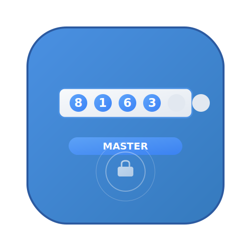

# OTPMaster

> 专业的OTP一次性密码自动管理工具，基于 Electron 开发的 macOS 桌面应用程序，专注于自动提取短信验证码并快速复制到剪贴板。

<p align="center">
  
</p>

<p align="center">
  <strong>智能 • 高效 • 安全</strong>
</p>

## ✨ 功能特性

- 🔍 **高速监控**: 1秒高频监控 macOS Messages 数据库，0.5秒内极速响应
- 📋 **智能识别**: 先进的正则表达式算法，准确识别多种格式的OTP验证码
- ⚡ **极速复制**: 检测到验证码后0.5秒内自动复制到剪贴板，无需手动操作
- 🖥️ **纯后台运行**: 静默后台运行，隐藏Dock图标，系统托盘简洁交互
- 🔐 **隐私安全**: 本地处理，零网络传输，不存储任何短信内容
- 🎯 **专业定位**: 专注OTP管理，当前支持短信验证码，4-8位数字和字母数字组合
- 🎨 **品牌一致**: 蓝色圆角矩形托盘图标，白色M字母设计
- ⚙️ **智能过滤**: 基于置信度算法，避免误识别普通数字

## 🔧 系统要求

- **操作系统**: macOS 10.14+ (Mojave 或更高版本)
- **架构**: 支持 Intel (x64) 和 Apple Silicon (arm64)
- **权限**: 需要完全磁盘访问权限
- **存储**: 约 50MB 可用空间
- **Messages应用**: 系统内置Messages应用正常工作

## 🏗️ 架构特点

### 纯后台架构
- **无窗口设计**: 应用启动后完全隐藏，不显示任何窗口界面
- **隐藏Dock图标**: 自动隐藏Dock图标，保持桌面整洁
- **系统托盘交互**: 仅通过系统托盘提供必要的操作选项
- **单实例运行**: 智能检测并确保只有一个应用实例运行

### 高性能监控
- **1秒监控间隔**: 每秒检查一次新消息，确保快速响应
- **智能查询优化**: 仅查询最近2分钟的消息，减少数据库负载
- **增量处理**: 只处理新接收的消息，避免重复处理
- **去重机制**: 智能去重，防止同一验证码被多次处理

## 🚀 快速开始

### 安装

1. 从 [Releases](https://github.com/otpmaster/otpmaster-electron/releases) 页面下载最新版本
2. 双击 `.dmg` 文件进行安装
3. 将 OTPMaster 拖拽到应用程序文件夹

### 首次使用

1. **启动应用**: 双击OTPMaster启动，应用会自动隐藏在后台
2. **授予权限**: 
   - 系统会提示需要完全磁盘访问权限
   - 打开“系统偏好设置” > “安全性与隐私” > “隐私” > “完全磁盘访问”
   - 添加 OTPMaster 并启用权限
3. **开始使用**: 应用会自动监控短信验证码，正常使用即可

## 📋 使用指南

### 权限配置（首次使用必需）

#### 完全磁盘访问权限（必需）
1. 打开“系统偏好设置” > “安全性与隐私” > “隐私”
2. 选择“完全磁盘访问”
3. 点击锁图标并输入密码（解锁设置）
4. 点击“+”按钮，选择 OTPMaster 应用
5. 确保 OTPMaster 旁边的复选框已勾选

> ⚠️ **重要**: 没有此权限，OTPMaster 无法访问 Messages 数据库，将无法正常工作。

### 日常使用

1. **自动启动**: 可将 OTPMaster 添加到“登录项”，开机自动启动
2. **静默运行**: 应用在后台静默运行，不会干扰正常使用
3. **自动处理**: 收到包含验证码的短信时，会自动复制到剪贴板
4. **简单使用**: 只需在需要输入验证码的地方按 Cmd+V 粘贴即可

### 托盘交互

点击系统托盘中的 OTPMaster 蓝色图标（白色M字母）可以快速操作：

- 📝 **关于 OTPMaster**: 查看应用信息和运行状态
- ❌ **退出**: 完全退出应用

## 验证码支持

### 性能特点

- **超低延迟**: 从短信接收到剪贴板复制全程不超过1秒
- **内存优化**: 仅占用约20-30MB内存，高效运行
- **CPU友好**: 智能间隔检查，避免高CPU占用
- **数据安全**: 仅读取Messages数据库，不存储任何内容
- **权限最小**: 仅请求必要的完全磁盘访问权限

### 支持范围
- **短信验证码**: 支持4-8位数字验证码 (如: 1234, 123456, 12345678)
- **字母数字**: 支持4-8位字母数字组合 (如: A1B2, XY123Z, ABC123)
- **带关键词**: 包含"验证码"、"code"、"verification"等关键词的消息

> 📧 **注意**: 当前版本仅支持短信验证码，邮箱验证码功能正在开发中

### 支持的语言
- **中文**: 验证码、驗證碼
- **英文**: verification code, verification, code, OTP
- **韩文**: 인증

### 检测逻辑
1. **关键词检测**: 短信内容必须包含验证码相关关键词
2. **格式匹配**: 使用正则表达式匹配验证码格式
3. **置信度计算**: 根据上下文和格式计算可信度
4. **最优选择**: 选择置信度最高的验证码

## 隐私与安全

- **本地处理**: 所有数据处理均在本地进行，不会上传到任何服务器
- **权限最小化**: 仅请求必要的系统权限
- **数据安全**: 不会存储或记录短信内容，仅提取验证码
- **开源透明**: 源代码公开，可审查安全性

## 故障排除

### 常见问题

#### 应用无法检测验证码
1. 确认已授予完全磁盘访问权限
2. 检查 Messages 应用是否正常工作
3. 验证短信内容是否包含支持的关键词
4. 重启 OTPMaster 应用

#### 验证码未自动复制
1. 确认短信内容包含验证码关键词（验证码、code等）
2. 检查验证码格式是否为4-8位数字或字母数字组合
3. 查看终端日志确认监控状态
4. 重启 OTPMaster 应用

#### 托盘图标消失
1. 检查系统托盘是否被隐藏
2. 重启 OTPMaster 应用
3. 在应用程序文件夹中重新启动

### 日志和调试

如需技术支持，可以：
1. 通过终端启动应用查看详细日志
2. 检查应用运行状态和错误信息
3. 联系技术支持并提供日志信息

```bash
# 在终端中启动应用查看日志
/Applications/OTPMaster.app/Contents/MacOS/OTPMaster
```

## 开发

### 环境要求
- Node.js 18+
- npm 或 yarn
- macOS 开发环境
- Electron 28.0.0

### 安装依赖
```bash
npm install
```

### 开发模式
```bash
# 启动开发服务器
npm run start
```

### 构建应用
```bash
# 构建源代码
npm run build

# 构建 macOS 应用程序
npm run build:mac
```

### 技术栈
- **框架**: Electron 28.0.0
- **语言**: TypeScript
- **数据库**: SQLite3 (Messages数据库)
- **构建工具**: electron-vite, electron-builder

### 项目结构
```
src/
├── main/          # 主进程代码
│   ├── index.ts   # 应用主入口
│   ├── monitor.ts # 短信监控服务
│   └── automation.ts # 自动化服务
└── shared/        # 共享代码
    ├── types.ts   # 类型定义
    ├── utils.ts   # 工具函数
    └── constants.ts # 常量配置
```

## 🤝 贡献

欢迎提交问题和功能请求！

1. Fork 项目
2. 创建特性分支 (`git checkout -b feature/amazing-feature`)
3. 提交更改 (`git commit -m 'Add some amazing feature'`)
4. 推送到分支 (`git push origin feature/amazing-feature`)
5. 创建 Pull Request

### 开发规范
- 遵循 TypeScript 编码标准
- 使用有意义的提交信息
- 添加必要的注释和文档
- 确保代码通过所有测试

## 🙏 致谢

本项目受到 [MessAuto](https://github.com/LeeeSe/MessAuto) 项目的启发和影响。感谢 MessAuto 项目作者的创新性工作和开源贡献，为 macOS 验证码自动化领域提供了宝贵的参考和灵感。

虽然 OTPMaster 采用了不同的技术架构和实现方式，但我们仍然要向 MessAuto 的先驱性工作致敬。

## 许可证

本项目基于 MIT 许可证开源 - 查看 [LICENSE](LICENSE) 文件了解详情。

## 支持

如果这个项目对您有帮助，请考虑：
- ⭐ 给项目加星
- 🐛 报告问题
- 💡 提出功能建议
- 🤝 贡献代码

---

**免责声明**: 本应用仅用于提高工作效率，请确保在符合当地法律法规的前提下使用。
